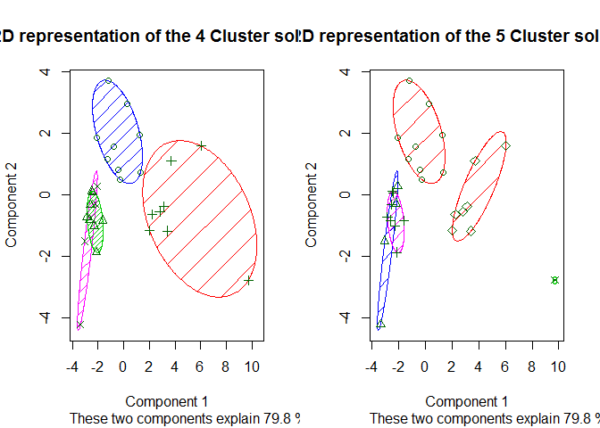

Loading libraries

    library(data.table)
    library(ggplot2);library(plotly);library(DT);library(highcharter)
    library(ggmap)
    library(plyr);library(dplyr)
    library(cluster);library(fpc)

    indian_cities <- fread("cities_r2.csv")
    attach(indian_cities)

    indian_cities <- as.data.table(indian_cities)

    state.wise <- indian_cities[,list(sum(population_total),sum(population_male),sum(population_female),
                                      sum(total_graduates),sum(literates_total),sum(literates_male),sum(literates_female),sum(male_graduates),sum(female_graduates)),
                                by = state_name]
    state.wise <- state.wise[order(state.wise$V1,decreasing = T),]
    names(state.wise) <- c("State","population_total","population_male","population_female",
                           "total_graduates","literates_total","literates_male","literates_female","male_graduates","female_graduates")

    state.wise <- state.wise[order(state.wise$population_total,decreasing = T),]

    options(scipen=999)

    #DT::datatable(state.wise)
    head(state.wise,20)

    ##               State population_total population_male population_female
    ##  1:     MAHARASHTRA         37722136        19961736          17760400
    ##  2:   UTTAR PRADESH         25302925        13433369          11869556
    ##  3:  ANDHRA PRADESH         18171615         9192368           8979247
    ##  4:     WEST BENGAL         18063509         9357777           8705732
    ##  5:         GUJARAT         17835049         9541688           8293361
    ##  6:       KARNATAKA         15799896         8112840           7687056
    ##  7:      TAMIL NADU         13879395         6957261           6922134
    ##  8:    NCT OF DELHI         13481997         7201322           6280675
    ##  9:  MADHYA PRADESH         11023091         5761143           5261948
    ## 10:       RAJASTHAN         10443016         5484470           4958546
    ## 11:           BIHAR          6714516         3558722           3155794
    ## 12:         HARYANA          5952223         3181968           2770255
    ## 13:          PUNJAB          5821876         3106473           2715403
    ## 14:       JHARKHAND          4278259         2247819           2030440
    ## 15:    CHHATTISGARH          3137918         1612019           1525899
    ## 16:          ORISSA          3003234         1560423           1442811
    ## 17:          KERALA          2755973         1335615           1420358
    ## 18: JAMMU & KASHMIR          1804987          953292            851695
    ## 19:           ASSAM          1391154          720132            671022
    ## 20:     UTTARAKHAND          1340397          706939            633458
    ##     total_graduates literates_total literates_male literates_female
    ##  1:         5266151        30514278       16794767         13719511
    ##  2:         3692166        17669408        9858998          7810410
    ##  3:         2751351        13463769        7178688          6285081
    ##  4:         2668776        14606480        7823632          6782848
    ##  5:         1994347        14154728        7921271          6233457
    ##  6:         2495820        12474974        6667390          5807584
    ##  7:         2144970        11385700        5920803          5464897
    ##  8:         2444280        10379026        5816335          4562691
    ##  9:         1592833         8391426        4638175          3753251
    ## 10:         1447819         7580529        4313228          3267301
    ## 11:          890106         4778390        2680498          2097892
    ## 12:         1059274         4484676        2524787          1959889
    ## 13:          835073         4431078        2449201          1981877
    ## 14:          611924         3220027        1803870          1416157
    ## 15:          450245         2413475        1321046          1092429
    ## 16:          530145         2458782        1335800          1122982
    ## 17:          460401         2401557        1173248          1228309
    ## 18:          270013         1226215         693916           532299
    ## 19:          242490         1154871         613955           540916
    ## 20:          274508         1019379         561383           457996
    ##     male_graduates female_graduates
    ##  1:        2908234          2357917
    ##  2:        2090734          1601432
    ##  3:        1668337          1083014
    ##  4:        1561629          1107147
    ##  5:        1130740           863607
    ##  6:        1441274          1054546
    ##  7:        1182839           962131
    ##  8:        1344320          1099960
    ##  9:         915594           677239
    ## 10:         863826           583993
    ## 11:         602353           287753
    ## 12:         577921           481353
    ## 13:         416208           418865
    ## 14:         381444           230480
    ## 15:         256774           193471
    ## 16:         321969           208176
    ## 17:         215434           244967
    ## 18:         148703           121310
    ## 19:         140832           101658
    ## 20:         144201           130307

    detach(indian_cities)
    attach(state.wise)
    a <- ggplot(state.wise,aes(x=reorder(State,population_total),y=population_total)) + 
      geom_bar(stat = "identity",fill = "#D55E00")+
      xlab("States") + ylab("Total population") + ggtitle("State by total population")+
      coord_flip()
    ggplotly()

<!--html_preserve-->

<!--/html_preserve-->
    hchart(state.wise,x=State,y=population_total,type = "column", color = State) %>%
      hc_title(text = "State by total population") %>% hc_add_theme(hc_theme_google())

<!--html_preserve-->

<!--/html_preserve-->
     hchart(state.wise,x=State,value = population_total,type = "treemap", color = population_total) %>%
      hc_title(text = "State by total population") %>% 
      hc_add_theme(hc_theme_google())

<!--html_preserve-->

<!--/html_preserve-->
The one is called literate if he/she is able to read and write.

Let's see states on the basis of total literacy

    hchart(state.wise,x=State,y=literates_total,type = "column",color = State) %>%
      hc_title(text = "State by total literate") 

<!--html_preserve-->

<!--/html_preserve-->
Maharashtra has the higghest number of total literate, but it also has
higghest total population.

    state.wise$Literacy.rate <- literates_total/population_total

    hchart(state.wise,x=State,y=Literacy.rate,type = "column",color = State) %>%
      hc_title(text = "State by total literate") %>% hc_yAxis(text = "Literacy rate")

<!--html_preserve-->

<!--/html_preserve-->
    ggplot(state.wise,aes(x=reorder(State,Literacy.rate),y=Literacy.rate))+
      geom_bar(stat = 'identity',fill = "#D55E00") + coord_flip()

So Kerala has the highest literacy rate, followed by Himachal Pradesh,
Mizoram, Tripura, Meghalaya and Assam. I had no idea that these states
has higher literacy rate than west bengal, Maharashtra and Gujarat.

### Which state has maximum number of graduates?

Now let's see graduates according to the states. There is a big
difference between graduates and literates. Literates are those who can
read and write whereas graduates are those who has successfully complete
an academic degree, course of training

    ggplot(state.wise,aes(x=reorder(State,total_graduates),y=total_graduates))+
      geom_bar(stat = 'identity',fill = "#D55E00") + coord_flip()

So maximum number of gradutaes are from maharashtra, followed by Uttar
Pradesh and so on.

Now, what percent of population graduates from each state?

    state.wise$graduate.ratio <- state.wise$total_graduates/state.wise$population_total

    ggplot(state.wise,aes(x=reorder(State,graduate.ratio),y=graduate.ratio))+
      geom_bar(stat = 'identity',fill = "#56B4E9",col = "black") + ggtitle("Percent of graduates")+coord_flip()

    hchart(state.wise,x=State,y=graduate.ratio,type = "column") %>%
       hc_title(text = "Percent of graduates")

<!--html_preserve-->

<!--/html_preserve-->
So Himachal pradesh has highest percentage of graduate, followed by
Manipur, Uttrakhand and so on. Mizoram has good percentage of literacy
rate (3rd highest) but as we can see it has lowest percentage of
graduate. Beside ranking, number doesn't seems to be good. The highest
percentage of graduates which is from Himachal Pradesh is 25.5%.

### Percentage of literate and graduate girls from each state

As we know girl's education is an issue in India. Now let's see which
state is facing this issue most.

    state.wise$female.literate <- state.wise$literates_female/state.wise$population_female
    state.wise$female_graduates.ratio <- state.wise$female_graduates/state.wise$population_female

    hchart(state.wise,x=State,y=female.literate,type = "column",color = State) %>%
      hc_title(text="Percentage of women litracy")

<!--html_preserve-->

<!--/html_preserve-->
    ggplot(state.wise,aes(x=reorder(State,female_graduates.ratio),y=female_graduates.ratio,fill=factor(State)))+
      geom_bar(stat = 'identity',col = "black") + 
      ggtitle("Percentage of graduate (female)") + xlab("States")+ylab("Percentage") +
      coord_flip()

    ggplot(state.wise,aes(x=reorder(State,female_graduates.ratio),y=female_graduates.ratio))+geom_bar(stat = 'identity',fill = "#CC79A7",col = "black") + 
      ggtitle("Percentage of graduate (female)") + xlab("States")+ylab("Percentage") +
      coord_flip()

So, as a result, Mizoram and Bihar followed by nagaland has least
graduate females, even less than 10%. This implies that less than 10% of
girls/females are graduate from Mizoram, Bihar and Nagaland.

Now let's do cluster analysis
-----------------------------

    state.wise$male.literate <- state.wise$literates_male/state.wise$population_total
    state.wise$sexRatio <- state.wise$population_male/state.wise$population_female
    States <- state.wise[,State]
    state.wise$State <- NULL
    detach(state.wise)
    # First we need to normalize the data

    state.wise.clust <- scale(state.wise)
    mean(state.wise.clust[,1])

    ## [1] 0.0000000000000000532605

    # Myscreeplot function plots scree plot for deciding number of centers for k-means 

    Myscreeplot <- function(data, n1 = 1,n2 =15, seed=4495){
      if(n1 == 1){
        wss <- (nrow(data)-1)*sum(apply(data,2,var))
        for (i in 2:n2){
          set.seed(seed)
          wss[i] <- sum(kmeans(data, centers=i)$withinss)}
        plot(1:n2, wss, type="b", xlab="Number of Clusters",
             ylab="Within groups sum of squares",main = "Scree Plot")
      }
      else
     { wss <- NULL
      j = 1
      for (i in n1:n2){
        set.seed(seed)
        wss[j] <- sum(kmeans(data, centers=i)$withinss)
        j = j+1
      }
      plot(n1:n2, wss, type="b", xlab="Number of Clusters",
           ylab="Within groups sum of squares",main = "Scree Plot")}}

    Myscreeplot(state.wise.clust,n1=1,n2=15)

I'll take 8 clusters

    set.seed(4495)
    clust <- kmeans(state.wise.clust,centers = 8)

    summary(clust)

    ##              Length Class  Mode   
    ## cluster       29    -none- numeric
    ## centers      120    -none- numeric
    ## totss          1    -none- numeric
    ## withinss       8    -none- numeric
    ## tot.withinss   1    -none- numeric
    ## betweenss      1    -none- numeric
    ## size           8    -none- numeric
    ## iter           1    -none- numeric
    ## ifault         1    -none- numeric

    plotcluster(state.wise.clust,clust$cluster)

    clusplot(state.wise.clust,clust$cluster,color = T,shade = T,lines = F,
             main = "2D representation of the Cluster solution")

    state.cluster <- data.frame(states = States,Cluster = clust$cluster)
    state.cluster <- state.cluster[order(state.cluster$Cluster),]

    #DT::datatable(state.cluster)
    state.cluster

    ##                       states Cluster
    ## 9             MADHYA PRADESH       1
    ## 10                 RAJASTHAN       1
    ## 11                     BIHAR       1
    ## 13                    PUNJAB       1
    ## 14                 JHARKHAND       1
    ## 15              CHHATTISGARH       1
    ## 12                   HARYANA       2
    ## 20               UTTARAKHAND       2
    ## 21                CHANDIGARH       2
    ## 2              UTTAR PRADESH       3
    ## 3             ANDHRA PRADESH       3
    ## 4                WEST BENGAL       3
    ## 5                    GUJARAT       3
    ## 6                  KARNATAKA       3
    ## 7                 TAMIL NADU       3
    ## 8               NCT OF DELHI       3
    ## 18           JAMMU & KASHMIR       4
    ## 23                   TRIPURA       5
    ## 24                   MIZORAM       5
    ## 28                  NAGALAND       5
    ## 29 ANDAMAN & NICOBAR ISLANDS       5
    ## 16                    ORISSA       6
    ## 17                    KERALA       6
    ## 19                     ASSAM       6
    ## 22                PUDUCHERRY       6
    ## 25                   MANIPUR       6
    ## 27                 MEGHALAYA       6
    ## 26          HIMACHAL PRADESH       7
    ## 1                MAHARASHTRA       8

Maharashtra is not only alone in cluster 8, it's also quite far with
respect to other states as we can see in cluster plots. This is because
Maharashtra has a high total population, total male population, and so
on (all the total count variables), which separates it from other state.

If we just consider percentage/ratios variable, than result will be
different

So let's do it.

    state.wise$male.literate <- state.wise$literates_male/state.wise$population_total
    state.wise$sexRatio <- state.wise$population_male/state.wise$population_female
    state.wise$graduate.male.ratio <- state.wise$male_graduates/state.wise$total_graduates
    state.wise$graduate.female.ratio <- 1 - state.wise$graduate.male.ratio

    state.wise$State<-NULL
    state.cluster <- subset(state.wise,select = c(10:17))

No need to normalize in this case.

    par(mfrow=c(1, 2))
    Myscreeplot(state.wise.clust,n1=1,n2=10)

    Myscreeplot(state.wise.clust,n1=4,n2=15)

Looks pretty confusing. But looks like 4-5 cluster will be good.

Well let's check

    set.seed(4495)
    clust1 <- kmeans(state.wise.clust,centers = 4)
    clust2 <- kmeans(state.wise.clust,centers = 5)
    summary(clust1)

    ##              Length Class  Mode   
    ## cluster      29     -none- numeric
    ## centers      60     -none- numeric
    ## totss         1     -none- numeric
    ## withinss      4     -none- numeric
    ## tot.withinss  1     -none- numeric
    ## betweenss     1     -none- numeric
    ## size          4     -none- numeric
    ## iter          1     -none- numeric
    ## ifault        1     -none- numeric

    summary(clust2)

    ##              Length Class  Mode   
    ## cluster      29     -none- numeric
    ## centers      75     -none- numeric
    ## totss         1     -none- numeric
    ## withinss      5     -none- numeric
    ## tot.withinss  1     -none- numeric
    ## betweenss     1     -none- numeric
    ## size          5     -none- numeric
    ## iter          1     -none- numeric
    ## ifault        1     -none- numeric

    par(mfrow=c(1, 2))
    clusplot(state.wise.clust,clust1$cluster,color = T,shade = T,lines = F,
             main = "2D representation of the 4 Cluster solution")
    clusplot(state.wise.clust,clust2$cluster,color = T,shade = T,lines = F,
             main = "2D representation of the 5 Cluster solution")

    par(mfrow=c(1, 2))
    plotcluster(state.wise.clust,clust1$cluster)
    plotcluster(state.wise.clust,clust2$cluster)

    state.cluster <- data.frame(states = States,Cluster = clust2$cluster)
    state.cluster <- state.cluster[order(state.cluster$Cluster),]

    DT::datatable(state.cluster)

<!--html_preserve-->

<!--/html_preserve-->
    state.cluster

    ##                       states Cluster
    ## 9             MADHYA PRADESH       1
    ## 10                 RAJASTHAN       1
    ## 11                     BIHAR       1
    ## 12                   HARYANA       1
    ## 13                    PUNJAB       1
    ## 14                 JHARKHAND       1
    ## 15              CHHATTISGARH       1
    ## 18           JAMMU & KASHMIR       1
    ## 28                  NAGALAND       1
    ## 20               UTTARAKHAND       2
    ## 21                CHANDIGARH       2
    ## 25                   MANIPUR       2
    ## 26          HIMACHAL PRADESH       2
    ## 16                    ORISSA       3
    ## 17                    KERALA       3
    ## 19                     ASSAM       3
    ## 22                PUDUCHERRY       3
    ## 23                   TRIPURA       3
    ## 24                   MIZORAM       3
    ## 27                 MEGHALAYA       3
    ## 29 ANDAMAN & NICOBAR ISLANDS       3
    ## 1                MAHARASHTRA       4
    ## 2              UTTAR PRADESH       5
    ## 3             ANDHRA PRADESH       5
    ## 4                WEST BENGAL       5
    ## 5                    GUJARAT       5
    ## 6                  KARNATAKA       5
    ## 7                 TAMIL NADU       5
    ## 8               NCT OF DELHI       5
